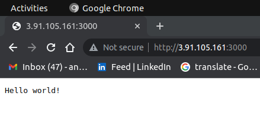

# Ansible in action!

It is a hands on experience configuring nodejs on a public AWS ec2 using Ansible

## Quick Start

1. configure you AWS CLI using your access key and secret access key
2. make `AWS key pairs` and download it on your machine
3. make a public `ec2` with tag `key=Project` and `value=Ansible`in AWS that allows:

   - inbound rules: allow custom `tcp` on port `3000` for nodejs
   - outbound rules: allow `tcp` on all ports

4. get ec2 public ip and store it in an inventory file under [all] section using the following commands:

   - `touch inventory echo [all] > inventory`
   - `aws ec2 describe-instances --query 'Reservations[*].Instances[*].PublicIpAddress'--filters "Name=tag:Project,Values=Ansible" --output text >> inventory`

5. allow ansible configure our ec2 according to the `setup` role that we have specified in `roles/setup/tasks/main.yml` using this command:

   - `ansible-playbook main.yml -i inventory --private-key [you-key.pem]`

6. verify you work by hitting the public URL on port 3000 on your browser

   
